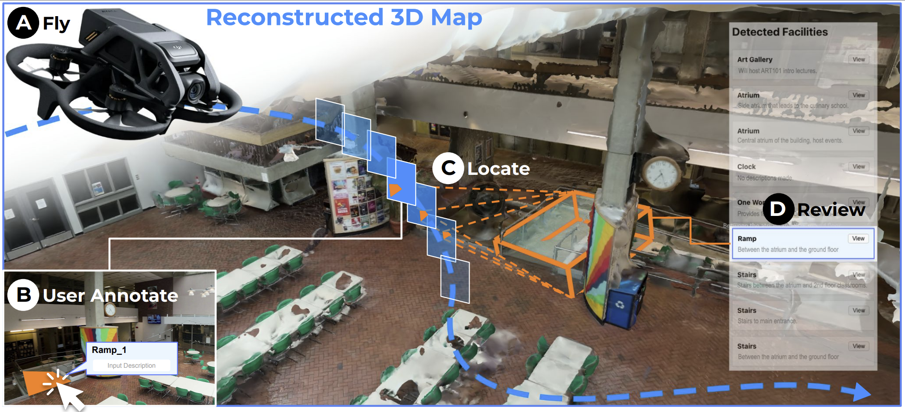

<p align="center">

<h1 align="center">FlyMeThrough: Human-AI Collaborative 3D Indoor Mapping with Commodity Drones</h1>

<p align="center">
  <a href="https://xiasu.github.io/">Xia Su</a><sup>*</sup>,
  <a href="https://ruiqi-chen-0216.github.io/">Ruiqi Chen</a><sup>*</sup>,
  <a href="https://jingweim.github.io/">Jingwei Ma</a>,
  <a href="https://www.chu-li.me/">Chu Li</a>,
  <a href="https://jonfroehlich.github.io/">Jon E. Froehlich</a>
  <br>
  <a href="https://makeabilitylab.cs.washington.edu/"><strong>Makeability Lab</strong></a>, University of Washington
  <br>
  <sup>*</sup>equal contribution
</p>

<h2 align="center">UIST 2025</h2>

<h3 align="center">
  <a href="#">Paper</a> | <a href="#">Project</a> | <a href="#">Demo</a>
</h3>

</p>

This repo accompanies our UIST 2025 paper:

> **FlyMeThrough: Human-AI Collaborative 3D Indoor Mapping with Commodity Drones**
> *Xia Su, Ruiqi Chen, Jingwei Ma, Chu Li, Jon E. Froehlich*
> In *Proceedings of the 38th Annual ACM Symposium on User Interface Software and Technology (UIST ’25)*
> Busan, Republic of Korea, September 28–October 1, 2025.
> DOI: [10.1145/XXXXX](https://doi.org/10.1145/XXXXXX)


---

**FlyMeThrough** is a human-AI collaborative indoor mapping system that provides an end-to-end pipeline for transforming RGB footage of indoor drone flights to POI-infused 3D reconstructed maps of the scanned indoor spaces. FlyMeThrough contains three major technical components: SfM (Structure from Motion)-based 3D reconstruction that transforms input RGB videos to estimated camera positions of video frames as well as 3D mesh models of the indoor spaces; A human-AI collaborative annotation pipeline that enables users to efficiently annotate and locate key indoor POIs; A web interface that reviews the final results, which are 3D models with bounding boxes indicating the locations and dimensions of key indoor POIs

---

## Installation

This project depends on two external modules: [**SAM2**](https://github.com/facebookresearch/sam2) and [**Depth-Pro**](https://github.com/apple/ml-depth-pro). Please make sure both are properly installed **before running this code**.

(If you intend to use your own depth data, however, installing Depth-Pro is not necessary. For details, please refer to *Run the pipeline on a single scene — Step 3*.)

We recommend creating a single virtual environment named `flymethrough` and installing both **SAM2** and **Depth-Pro** inside it. Using miniconda:

```bash
conda create -n flymethrough -y python=3.10
conda activate flymethrough
```

The code requires `python>=3.10`, as well as `torch>=2.5.1` and `torchvision>=0.20.1`. Please follow the instructions [here](https://pytorch.org/get-started/locally/) to install both PyTorch and TorchVision dependencies. You can install on a GPU machine using:

```bash
git clone https://github.com/facebookresearch/sam2.git && cd sam2
pip install -e .

cd ..  # go back to the project root

git clone https://github.com/apple/ml-depth-pro.git && cd ml-depth-pro
pip install -e .
cd ..  # go back to the project root
```

If you are installing on Windows, it's strongly recommended to use [Windows Subsystem for Linux (WSL)](https://learn.microsoft.com/en-us/windows/wsl/install) with Ubuntu.

After installing **SAM2** and **Depth-Pro**, you also need to install the dependencies specific to this project.  


```bash
pip install -r requirements.txt
```

Note:
1. It's recommended to create a new Python environment via [Anaconda](https://www.anaconda.com/) for this installation and install PyTorch 2.5.1 (or higher) via `pip` following https://pytorch.org/. If you have a PyTorch version lower than 2.5.1 in your current environment, the installation command above will try to upgrade it to the latest PyTorch version using `pip`.
2. The step above requires compiling a custom CUDA kernel with the `nvcc` compiler. If it isn't already available on your machine, please install the [CUDA toolkits](https://developer.nvidia.com/cuda-toolkit-archive) with a version that matches your PyTorch CUDA version.
3. If you see a message like `Failed to build the SAM 2 CUDA extension` during installation, you can ignore it and still use SAM 2 (some post-processing functionality may be limited, but it doesn't affect the results in most cases).


## Run the pipeline on a single scene

In this section, we provide information on how to run the pipeline for a single scene. In particular, we divide this section into four parts:
1. Download **checkpoints**
2. Check the format of **scene's data**
3. Set up **configurations** 
4. **Run** FlyMeThrough 

### Step 1: Download Checkpoints

First, we need to download the model checkpoint. All the model checkpoints can be downloaded by running:

```bash
cd sam2/checkpoints && \
./download_ckpts.sh && \
cd ../..

cd ml-depth-pro
source get_pretrained_models.sh  # Files will be downloaded to `checkpoints` directory.
cd ..
```

or individually from:

- [sam2.1_hiera_tiny.pt](https://dl.fbaipublicfiles.com/segment_anything_2/092824/sam2.1_hiera_tiny.pt)
- [sam2.1_hiera_small.pt](https://dl.fbaipublicfiles.com/segment_anything_2/092824/sam2.1_hiera_small.pt)
- [sam2.1_hiera_base_plus.pt](https://dl.fbaipublicfiles.com/segment_anything_2/092824/sam2.1_hiera_base_plus.pt)
- [sam2.1_hiera_large.pt](https://dl.fbaipublicfiles.com/segment_anything_2/092824/sam2.1_hiera_large.pt)

### Step 2: Check the folder structure of the data for your scene 
In order to run FlyMeThrough you need to have access to the point cloud of the scene as well to the posed RGB-D frames.

We recommend creating a folder `scene_example` inside the `Data` folder where the data is saved. 
```
scene_example
      ├── pose                            <- folder with camera poses
      │      ├── 00000.txt 
      │      ├── 00001.txt 
      │      └── ...  
      ├── frame                           <- folder with RGB images
      │      ├── 00000.jpg (or .png/.jpeg)
      │      ├── 00001.jpg (or .png/.jpeg)
      │      └── ...  
      ├── depth                           <- folder with depth images
      │      ├── 00000.png (or .jpg/.jpeg)
      │      ├── 00001.png (or .jpg/.jpeg)
      │      └── ...  
      ├── intrinsic                 
      │      └── intrinsic_color.txt       <- camera intrinsics
      ├── sam2results
      │      └── <object_id_folder>        <- will be auto generated by sam2server.py
      ├── sam2masks
      │      └── <object_id_folder>        <- will be auto generated by sam2server.py
      └── scene_example.ply                <- point cloud of the scene

```

Please note the followings:
* The **point cloud** should be provided as a `.ply` or `.obj` file and the points are expected to be in the z-up right-handed coordinate system, or at least the same direction as camera poses and intrinsics.
* The **camera intrinsics** and **camera poses** should be provided in a `.txt` file, containing a 4x4 matrix.
* The **RGB images** and the **depths** can be either in `.png`, `.jpg`, `.jpeg` format; the used format should be specified as explained in **Step 3**.
* The **RGB images** and their corresponding **depths** and **camera poses** should be named as `{FRAME_ID}.extension`, without zero padding for the frame ID, starting from index 00000.

### Step 3: Set-up the paths to data and to output folders 
Before running **FlyMeThrough**, please ensure that you adapt the relevant modules in the pipeline according to your own data format and setup, reflecting the modularity of the implementation—one of the main contributions of our paper.  

In particular, you should adjust the following component:  
* In `diamserver/camera_utils.py`, modify the logic to correctly read the **pose** and **intrinsic parameters** from your own data source.  
  By default, the provided code reads camera parameters from a `MetaShape_camera.XML` file. If your dataset uses a different format, please replace this part with the appropriate implementation to parse your specific data.
* Our depth data is generated by **Depth-Pro** and stored in the `depth.npz` format. You can run **Depth-Pro** with the following command:
```bash
python diamserver/run_depth.py
```
  This script will take your frames from the `frame` folder as input and output the corresponding `depth.npz` file into the `depth` folder.
  If you prefer to use your own depth data like in `depth.png` format, please modify `diamserver/edit_segdep.py`, which is responsible for combining the segmentation data from **SAM2** and the depth data from **Depth-Pro**. You should      adjust this module to correctly load and integrate your custom depth data into the pipeline.

### Step 4: Run FlyMeThrough
Now you can run **FlyMeThrough** using the following commands:

```bash
# Start the DIAM server
python diamserver/DIAMserver.py

# Start the SAM2 server
python sam2server/sam2server.py
```
After starting both servers, you can open the annotation and visualization interfaces and start exploring the system!

## Acknowledgments

We would like to thank the authors of [SAM2](https://github.com/facebookresearch/sam2) and [Depth-Pro](https://github.com/apple/ml-depth-pro) for their works which were used for our model.


## Citing FlyMeThrough

If you use FlyMeThrough or the structure in your research, please use the following BibTeX entry.

```bibtex
@inproceedings{su2025flymethrough,
  author       = {Xia Su and others},
  title        = {FlyMeThrough: Human-AI Collaborative 3D Indoor Mapping with Commodity Drones},
  booktitle    = {Proceedings of the 38th Annual ACM Symposium on User Interface Software and Technology (UIST ’25)},
  year         = {2025},
  doi          = {10.1145/XXXXX},
  publisher    = {ACM},
  location     = {Busan, Republic of Korea}
}
```

## TODO

We plan to release the complete scripts to this repository shortly, including:  
- The annotation and visualization interfaces code of *FlyMeThrough*.  

## Contact

If you have any questions or encounter any issues, please feel free to open an [issue](../../issues) on this repository,  
or contact the co-first author **Ruiqi Chen** directly.


